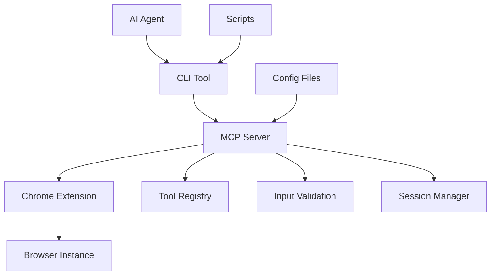

# Browser-MCP-Control System

## 🎯 Project Overview

**Objective**: Create a comprehensive browser automation system using Model Context Protocol (MCP) that enables AI agents to control Chrome browsers through a secure, local-first architecture.

**Core Components**:
- 🌐 **Chrome Extension**: Browser interface và DOM manipulation
- 🔗 **MCP Server**: Protocol bridge và tool registry  
- 💻 **CLI Tool**: Script execution và AI agent integration

---

## 📊 Research Analysis: Existing MCP Browser Solutions

### 1. Chrome MCP Server (hangwin/mcp-chrome)

**Repository**: `hangwin/mcp-chrome`  
**Architecture**: Chrome Extension ↔ WebSocket ↔ MCP Server ↔ CLI/AI

#### Strengths ✅
- **Comprehensive Tool Set**: 20+ built-in tools
  - Screenshot capture với multiple formats
  - Network monitoring và request interception
  - Bookmark management và navigation
  - Cookie và storage manipulation
  - Tab management và window control
- **NPM Bridge Package**: `mcp-chrome-bridge` for CLI integration
- **Streamable HTTP**: Real-time data streaming support
- **Mature Codebase**: Well-documented với extensive examples

#### Technical Implementation
```javascript
// Extension Architecture
Content Script → Background Script → WebSocket → MCP Server
                      ↓
               Chrome APIs Access
```

#### Weaknesses ⚠️
- Limited security model (broad permissions)
- Session management needs improvement
- CLI integration complexity
- Resource usage optimization needed

---

### 2. Browser Tools MCP (AgentDeskAI)

**Repository**: `AgentDeskAI/browser-tools-mcp`  
**Architecture**: Chrome Extension ↔ Node Middleware ↔ MCP Server ↔ CLI

#### Unique Features ✨
- **Lighthouse Integration**: 
  - SEO auditing automation
  - Performance metrics collection
  - Accessibility compliance checking
  - Best practices validation
- **IDE Integration**: Auto-paste screenshots vào Cursor IDE
- **NPX CLI**: `npx @agentdeskai/browser-tools-mcp@latest`
- **Development Workflow**: Optimized for developer tools

#### Technical Advantages
```yaml
Quality Assurance:
  - Lighthouse audits: SEO, Performance, Accessibility
  - Automated screenshot documentation
  - Performance monitoring dashboard
  
Development Integration:
  - Cursor IDE plugin support
  - VS Code extension compatibility
  - Automated testing integration
```

#### Limitations ⚠️
- Focused primarily on development use cases
- Limited general automation capabilities
- Dependency on specific IDE ecosystem

---

### 3. Browser MCP (BrowserMCP/mcp)

**Repository**: `BrowserMCP/mcp`  
**Architecture**: MCP Server + Chrome Extension + IDE Multi-Integration

#### Key Innovations 🚀
- **Local-First Security**: All processing stays on local machine
- **Session Persistence**: Maintains login states across automations
- **Natural Browser Behavior**: Standard interaction patterns
- **Multi-IDE Support**: VS Code, Claude Desktop, Cursor integration
- **Playwright Foundation**: Built on robust automation framework

#### Security Architecture
```yaml
Privacy Model:
  - Zero external API calls
  - Local data processing only
  - Encrypted inter-component communication
  - Session isolation sandbox

Standard Behavior:
  - Consistent interaction patterns
  - Predictable timing
  - Standard browser automation  
  - Regular Chrome Extension APIs
```

#### Enterprise Features
- Audit logging for compliance
- Role-based access control
- Centralized configuration management
- Integration với enterprise SSO

---

### 4. MCP CLI Tools Ecosystem

#### 4a. mcptools (f/mcptools)
**Language**: Go  
**Focus**: Performance và Development Tools

```bash
# Core Commands
mcp tools        # List available tools
mcp call         # Execute specific tool
mcp shell        # Interactive mode
mcp mock         # Mock server for testing
mcp proxy        # Proxy server capabilities
```

**Advantages**:
- High performance Go implementation
- Excellent debugging capabilities
- Mock server for development
- Low resource consumption

#### 4b. mcp-cli (chrishayuk)
**Language**: Node.js/TypeScript  
**Focus**: Rich User Experience

```yaml
Interaction Modes:
  - Command Mode: Single command execution
  - Interactive Mode: REPL-style interaction
  - Chat Mode: Conversational AI interface

LLM Providers:
  - OpenAI (GPT-3.5, GPT-4)
  - Anthropic (Claude)
  - Ollama (Local models)
  - Custom provider integration

Features:
  - Concurrent tool execution
  - Streaming responses
  - Rich terminal UI
  - Session management
```

#### 4c. cli-mcp-server (MladenSU)
**Language**: Node.js  
**Focus**: Enterprise Security

```yaml
Security Features:
  - Command whitelisting
  - Path validation
  - Sandbox execution
  - Audit logging
  - Role-based permissions

Configuration:
  - Environment variables
  - JSON config files
  - Runtime policy updates
  - Integration policies

Enterprise Integration:
  - Claude Desktop integration
  - SSO authentication
  - Compliance reporting
  - Centralized management
```

---

### 5. Chrome Extension Bridge MCP

**Architecture**: Chrome Extension ↔ WebSocket ↔ Local MCP Server

#### Technical Capabilities
```javascript
// Direct Browser Access
window.mcp = {
  resources: {
    'mcp:resource.dom': DOMUtils,
    'mcp:resource.storage': StorageUtils,
    'mcp:resource.network': NetworkUtils
  },
  tools: {
    'mcp:tool.screenshot': ScreenshotTool,
    'mcp:tool.navigate': NavigationTool,
    'mcp:tool.interact': InteractionTool
  }
}
```

#### Features
- Direct global window object access
- Real-time bidirectional communication
- Low-latency tool execution
- Flexible resource management

---

## 🏗️ Recommended Architecture: Simple MCP Browser System

### System Overview

Based on comprehensive analysis, đây là simplified architecture focusing on core browser automation functionality:



### Component Architecture

#### 1. 🌐 Chrome Extension (Browser Interface)
**Simple browser automation without stealth features**

```yaml
Core Capabilities:
  - DOM manipulation và element interaction
  - Screenshot capture với basic formats
  - Cookie và local storage access
  - Tab và window management
  - Form filling và submission
  - Basic navigation control
  - Data extraction (text, attributes)
  
Standard Browser APIs:
  - chrome.tabs API for tab management
  - chrome.storage API for data persistence
  - Content scripts for DOM interaction
  - Background scripts for coordination
  
Security:
  - Content Security Policy compliance
  - Minimal required permissions
  - Input validation
  - Secure message passing
```

#### 2. 🔗 MCP Server (Protocol Bridge & Central Hub)
**MCP Server là "trung tâm điều phối thông minh" - nhiệm vụ chính của hệ thống**

## 🎯 MCP Server - Vai trò và Nhiệm vụ

### **MCP Server đóng vai trò là "Cầu nối thông minh" (Intelligent Bridge)**

```
AI Agent/CLI ←→ MCP Server ←→ Chrome Extension ←→ Browser
   (Commands)     (Translation)    (Browser Actions)   (Web Pages)
```

### **5 Nhiệm vụ Core của MCP Server:**

#### ✅ **1. Protocol Translation (Dịch giao thức)**
- **Input**: Nhận MCP standard commands từ AI agents
- **Processing**: Chuyển đổi thành browser-specific actions  
- **Output**: Trả về kết quả theo MCP format chuẩn

```javascript
// Example: AI gửi MCP command
Input: { tool: "mcp:tool.screenshot", parameters: { element: "#main" } }
       ↓ MCP Server xử lý
Processing: Convert to Chrome Extension action
       ↓ 
Output: { success: true, data: "base64_screenshot", metadata: {...} }
```

#### ✅ **2. Tool Registry & Discovery (Quản lý và khám phá công cụ)**
- **Tool Registration**: Đăng ký available tools (`mcp:tool.click`, `mcp:tool.navigate`)
- **Auto-Discovery**: AI agents tự động phát hiện tools có sẵn
- **Parameter Validation**: Kiểm tra input theo schema được định nghĩa

```yaml
Tool Registry Example:
  mcp:tool.screenshot:
    description: "Capture page or element screenshot"
    parameters:
      element: { type: "string", required: false }
      fullPage: { type: "boolean", default: false }
    
  mcp:tool.click:
    description: "Click on page element"
    parameters:
      selector: { type: "string", required: true }
      button: { type: "string", enum: ["left", "right"], default: "left" }
```

#### ✅ **3. Session Management (Quản lý phiên làm việc)**
- **Multi-Session**: Quản lý nhiều browser sessions đồng thời
- **State Persistence**: Duy trì trạng thái giữa các tool calls
- **Session Isolation**: Mỗi session độc lập, không ảnh hưởng lẫn nhau

#### ✅ **4. Communication Hub (Trung tâm giao tiếp)**
- **WebSocket Server**: Kết nối real-time với Chrome Extension
- **HTTP API Server**: Phục vụ CLI tools và AI agents
- **Message Routing**: Định tuyến messages giữa components

#### ✅ **5. Security & Validation (Bảo mật và kiểm tra)**
- **Input Sanitization**: Làm sạch input để tránh injection attacks
- **Command Whitelisting**: Chỉ cho phép safe commands được thực thi
- **Rate Limiting**: Giới hạn số requests để tránh abuse

```yaml
Architecture:
  - WebSocket server for Chrome Extension
  - HTTP server for CLI tool
  - Tool registry và discovery system
  - Session management và persistence
  - Security policy enforcement
  
Tool Categories:
  Navigation:
    - mcp:tool.navigate
    - mcp:tool.back_forward
    - mcp:tool.refresh
    - mcp:tool.wait_for_element
    
  Interaction:
    - mcp:tool.click
    - mcp:tool.type
    - mcp:tool.select
    - mcp:tool.drag_drop
    
  Data Extraction:
    - mcp:tool.get_text
    - mcp:tool.get_attribute
    - mcp:tool.screenshot
    - mcp:tool.pdf_export
    
  Monitoring:
    - mcp:tool.network_monitor
    - mcp:tool.performance_metrics
    - mcp:tool.console_logs
    - mcp:tool.lighthouse_audit

Security Policies:
  - Command whitelisting system
  - Path validation for file operations
  - Resource usage limits
  - Audit logging for compliance
  - Rate limiting protection
```

#### 3. 💻 CLI Tool (AI Integration)
**Simple command-line interface for browser automation**

```yaml
Interaction Modes:
  Command Mode:
    - mcp-browser screenshot --element "#main"
    - mcp-browser navigate --url "https://example.com"
    - mcp-browser click --selector ".button"
    
  Interactive Mode:
    - REPL-style browser control
    - Real-time feedback
    - Session management
    
  Script Mode:
    - JavaScript automation scripts
    - Batch processing support
    - Template-based operations

Basic AI Integration:
  - OpenAI GPT models
  - Anthropic Claude
  - Simple command translation
  - Error handling assistance
  
Core Features:
  - Tool execution
  - Progress feedback
  - Session persistence
  - Basic logging
```

---

## 🛠️ Technical Specifications

### Communication Protocols

#### Extension ↔ MCP Server
```javascript
// WebSocket Message Format
{
  "type": "tool_call",
  "id": "unique_request_id",
  "tool": "mcp:tool.screenshot",
  "parameters": {
    "element": "#main-content",
    "format": "png",
    "full_page": false
  },
  "timestamp": "2024-01-01T12:00:00Z"
}

// Response Format
{
  "type": "tool_response",
  "id": "unique_request_id",
  "success": true,
  "data": {
    "screenshot": "base64_encoded_image",
    "metadata": {
      "width": 1920,
      "height": 1080,
      "timestamp": "2024-01-01T12:00:01Z"
    }
  }
}
```

#### CLI ↔ MCP Server
```yaml
# HTTP API Endpoints
GET  /api/tools                    # List available tools
POST /api/tools/{tool_name}/call   # Execute tool
GET  /api/sessions                 # List active sessions
POST /api/sessions                 # Create new session
DELETE /api/sessions/{id}          # Close session

# Streaming WebSocket
/ws/stream/{session_id}            # Real-time updates
```

### Tool Registry System

```yaml
Tool Definition Schema:
  name: string                     # mcp:tool.screenshot
  description: string              # Tool purpose
  parameters:                      # JSON Schema
    type: object
    properties: {}
    required: []
  security_level: enum             # public, restricted, admin
  rate_limit: number               # calls per minute
  dependencies: array              # required browser features
  examples: array                  # usage examples

Registration Process:
  1. Tool validation against schema
  2. Security policy check
  3. Dependency verification
  4. Registry update
  5. Client notification
```

### Security Framework

#### Multi-Layer Security Model
```yaml
Layer 1 - Browser Extension:
  - Content Security Policy enforcement
  - Minimal permission model
  - Origin validation
  - Input sanitization

Layer 2 - MCP Server:
  - Command whitelisting
  - Path traversal protection
  - Resource usage limits
  - Session isolation

Layer 3 - CLI Tool:
  - Script validation
  - User authentication
  - Audit logging
  - Rate limiting

Layer 4 - Network:
  - TLS encryption
  - Certificate pinning
  - Local-only communication
  - Port restrictions
```

#### Configuration Management
```yaml
# Security Policy Configuration
security:
  whitelist:
    commands: ["navigate", "screenshot", "click"]
    domains: ["*.example.com", "localhost"]
    paths: ["/safe/directory/*"]
  
  limits:
    max_concurrent_sessions: 5
    max_request_rate: 60  # per minute
    max_screenshot_size: "10MB"
    session_timeout: "30m"
  
  audit:
    enabled: true
    log_level: "info"
    retention_days: 90
    export_format: "json"
```

---

## 🚦 Implementation Roadmap

### Phase 1: Foundation (Weeks 1-2)
**Objective**: Establish core architecture và basic functionality

#### Week 1: Core Infrastructure
- [ ] **MCP Server Setup**
  - WebSocket server implementation
  - HTTP API endpoints
  - Basic tool registry
  - Configuration management
  
- [ ] **Chrome Extension Base**
  - Manifest V3 setup
  - Content script injection
  - Background service worker
  - Basic DOM interaction tools

#### Week 2: Communication Layer
- [ ] **Protocol Implementation**
  - Extension ↔ Server WebSocket connection
  - CLI ↔ Server HTTP API
  - Message serialization/deserialization
  - Error handling và retry logic

- [ ] **Security Foundation**
  - Basic authentication
  - Command whitelisting
  - Input validation
  - Audit logging setup

### Phase 2: Core Tools (Weeks 3-4)

#### Week 3: Essential Automation Tools
- [ ] **Navigation Tools**
  - `mcp:tool.navigate` - URL navigation
  - `mcp:tool.wait_for_element` - Element waiting
  - `mcp:tool.back_forward` - History navigation
  - `mcp:tool.refresh` - Page reload

- [ ] **Interaction Tools**
  - `mcp:tool.click` - Element clicking
  - `mcp:tool.type` - Text input
  - `mcp:tool.select` - Dropdown selection
  - `mcp:tool.scroll` - Page scrolling

#### Week 4: Data Extraction Tools
- [ ] **Content Tools**
  - `mcp:tool.get_text` - Text extraction
  - `mcp:tool.get_attribute` - Attribute retrieval
  - `mcp:tool.screenshot` - Image capture
  - `mcp:tool.get_html` - HTML source

- [ ] **Monitoring Tools**
  - `mcp:tool.network_monitor` - Network tracking
  - `mcp:tool.console_logs` - Console monitoring
  - `mcp:tool.performance_metrics` - Performance data

### Phase 3: Advanced Features (Weeks 5-6)

#### Week 5: Advanced Automation Features
- [ ] **Enhanced Interaction Tools**
  - Improved element detection
  - Better error handling
  - Multiple screenshot formats
  - Advanced form handling

- [ ] **Performance Optimization**
  - Faster tool execution
  - Memory usage optimization
  - Better caching strategies  
  - Connection pooling

#### Week 6: CLI Tool Development
- [ ] **Command Interface**
  - Basic command parsing
  - Script execution engine
  - Session management
  - Progress feedback

- [ ] **AI Integration**
  - OpenAI GPT integration
  - Anthropic Claude support
  - Local model support (Ollama)
  - Conversation context management

### Phase 4: Enterprise Features (Weeks 7-8)

#### Week 7: Quality Assurance Integration
- [ ] **Lighthouse Integration**
  - SEO auditing automation
  - Performance benchmarking
  - Accessibility testing
  - Best practices validation

- [ ] **Testing Framework**
  - Automated test generation
  - Regression testing
  - Visual diff comparison
  - Test report generation

#### Week 8: Production Readiness
- [ ] **Security Hardening**
  - Penetration testing
  - Vulnerability assessment
  - Security policy refinement
  - Compliance validation

- [ ] **Performance Optimization**
  - Memory usage optimization
  - CPU performance tuning
  - Network efficiency improvements
  - Caching strategies

---

## 💡 Use Cases và Implementation Examples

### 1. Web Scraping Automation

#### Scenario: E-commerce Product Monitoring
```javascript
// CLI Command
mcp-browser exec monitor-products.js --config ecommerce.json

// Script Implementation
const session = await mcp.createSession({
  browser: "chrome",
  headless: false
});

await session.navigate("https://example-shop.com/products");
await session.waitForElement(".product-list");

const products = await session.getElements(".product-item");
for (const product of products) {
  const data = {
    name: await product.getText(".product-name"),
    price: await product.getText(".product-price"),
    availability: await product.getAttribute(".stock-status", "data-status"),
    imageUrl: await product.getAttribute(".product-image img", "src")
  };
  
  await session.screenshot({
    element: product,
    filename: `product-${data.name.replace(/\s+/g, '-')}.png`
  });
  
  console.log("Product data:", data);
}
```

### 2. Automated Testing Integration

#### Scenario: E2E Testing với AI-Generated Test Cases
```javascript
// AI-Generated Test Scenario
const testScenario = await ai.generateTest({
  userStory: "As a user, I want to complete a purchase flow",
  pages: ["login", "product-selection", "checkout", "payment"],
  assertions: ["successful-login", "cart-total-correct", "payment-success"]
});

// Execute Test
const testSession = await mcp.createSession({
  recordVideo: true,
  generateReport: true
});

for (const step of testScenario.steps) {
  try {
    await testSession.execute(step.action, step.parameters);
    
    // AI-powered assertion validation
    const pageState = await testSession.getPageState();
    const isValid = await ai.validateAssertion(step.assertion, pageState);
    
    if (!isValid) {
      await testSession.screenshot({
        filename: `error-${step.name}-${Date.now()}.png`
      });
      throw new Error(`Assertion failed: ${step.assertion}`);
    }
    
  } catch (error) {
    await testSession.captureDebugInfo();
    throw error;
  }
}
```

### 3. SEO Audit Automation

#### Scenario: Multi-Page Lighthouse Auditing
```javascript
// CLI Command
mcp-browser audit --lighthouse --pages-file urls.txt --output report.json

// Implementation
const auditSession = await mcp.createSession({
  networkThrottling: "3G",
  device: "mobile"
});

const urls = await fs.readFile("urls.txt", "utf8").split("\n");

for (const url of urls) {
  await auditSession.navigate(url);
  
  const audit = await auditSession.runLighthouse({
    categories: ["performance", "accessibility", "seo", "best-practices"],
    output: "json"
  });
  
  const report = {
    url: url,
    timestamp: new Date().toISOString(),
    scores: {
      performance: audit.lhr.categories.performance.score * 100,
      accessibility: audit.lhr.categories.accessibility.score * 100,
      seo: audit.lhr.categories.seo.score * 100,
      bestPractices: audit.lhr.categories["best-practices"].score * 100
    },
    metrics: audit.lhr.audits,
    recommendations: generateRecommendations(audit.lhr)
  };
  
  console.log(`Audit complete for ${url}:`, report.scores);
}
```

### 4. Content Management Automation

#### Scenario: Bulk Content Publishing
```javascript
// Content Publishing Workflow
const contentSession = await mcp.createSession({
  loginCredentials: process.env.CMS_CREDENTIALS,
  sessionPersistence: true
});

const contentItems = await loadContentFromCSV("content-batch.csv");

for (const item of contentItems) {
  // Login if needed
  if (!await contentSession.isLoggedIn()) {
    await contentSession.login();
  }
  
  // Navigate to content creation
  await contentSession.navigate("/admin/content/new");
  
  // Fill content form
  await contentSession.type("#title", item.title);
  await contentSession.type("#content", item.body);
  await contentSession.select("#category", item.category);
  
  // Upload featured image
  if (item.featuredImage) {
    await contentSession.uploadFile("#featured-image", item.featuredImage);
  }
  
  // Set publication schedule
  if (item.publishDate) {
    await contentSession.click("#schedule-toggle");
    await contentSession.type("#publish-date", item.publishDate);
  }
  
  // Publish or save draft
  const publishButton = item.status === "publish" ? "#publish" : "#save-draft";
  await contentSession.click(publishButton);
  
  // Verify success
  const successMessage = await contentSession.waitForElement(".success-message");
  console.log(`Content published: ${item.title}`);
  
  // Add delay to avoid rate limiting
  await contentSession.wait(2000);
}
```

### 5. AI-Powered Form Automation

#### Scenario: Intelligent Form Filling
```javascript
// AI-Enhanced Form Completion
const formSession = await mcp.createSession({
  aiProvider: "anthropic",
  model: "claude-3.5-sonnet"
});

await formSession.navigate("https://complex-form.example.com");

// AI analyzes the form structure
const formAnalysis = await ai.analyzeForm({
  html: await formSession.getHTML(),
  purpose: "job application form",
  userProfile: await loadUserProfile()
});

// Fill form based on AI recommendations
for (const field of formAnalysis.fields) {
  const value = await ai.generateFieldValue({
    fieldType: field.type,
    fieldLabel: field.label,
    requirements: field.requirements,
    userProfile: userProfile
  });
  
  switch (field.type) {
    case "text":
    case "email":
    case "tel":
      await formSession.type(field.selector, value);
      break;
      
    case "select":
      await formSession.select(field.selector, value);
      break;
      
    case "radio":
      await formSession.click(`${field.selector}[value="${value}"]`);
      break;
      
    case "checkbox":
      if (value === true) {
        await formSession.click(field.selector);
      }
      break;
      
    case "file":
      await formSession.uploadFile(field.selector, value);
      break;
  }
  
  // Validate field completion
  const isValid = await formSession.validateField(field.selector);
  if (!isValid) {
    console.warn(`Field validation failed: ${field.label}`);
  }
}

// AI reviews form before submission
const reviewResult = await ai.reviewForm({
  formData: await formSession.getFormData(),
  requirements: formAnalysis.requirements
});

if (reviewResult.readyToSubmit) {
  await formSession.click("#submit-button");
  console.log("Form submitted successfully");
} else {
  console.log("Form needs review:", reviewResult.issues);
}
```

---

## 🔧 Error Handling & Recovery Strategies

### Error Classification System

```yaml
Error Categories:
  Network Errors:
    - Connection timeout
    - DNS resolution failure
    - SSL certificate issues
    - Rate limiting responses
    
  Browser Errors:
    - Page load failures
    - JavaScript execution errors
    - Element not found
    - Permission denied
    
  Tool Errors:
    - Invalid parameters
    - Unsupported operations
    - Resource constraints
    - Security violations
    
  System Errors:
    - Memory exhaustion
    - Disk space issues
    - Process crashes
    - Configuration errors
```

### Recovery Mechanisms

#### 1. Automatic Retry Logic
```javascript
class RetryHandler {
  async execute(tool, parameters, options = {}) {
    const {
      maxRetries = 3,
      retryDelay = 1000,
      backoffMultiplier = 2,
      retryableErrors = ['NETWORK_ERROR', 'TIMEOUT', 'ELEMENT_NOT_FOUND']
    } = options;
    
    for (let attempt = 1; attempt <= maxRetries; attempt++) {
      try {
        const result = await this.executeTool(tool, parameters);
        return result;
        
      } catch (error) {
        if (!retryableErrors.includes(error.code) || attempt === maxRetries) {
          throw error;
        }
        
        const delay = retryDelay * Math.pow(backoffMultiplier, attempt - 1);
        await this.wait(delay);
        
        console.log(`Retry attempt ${attempt}/${maxRetries} for ${tool}`);
      }
    }
  }
}
```

#### 2. Session Recovery
```javascript
class SessionManager {
  async recoverSession(sessionId) {
    const session = this.sessions.get(sessionId);
    
    if (!session || !session.isHealthy()) {
      // Attempt to restore from checkpoint
      const checkpoint = await this.loadCheckpoint(sessionId);
      
      if (checkpoint) {
        const newSession = await this.createSession(checkpoint.config);
        await this.restoreState(newSession, checkpoint.state);
        return newSession;
      }
      
      // Create fresh session
      return await this.createSession();
    }
    
    return session;
  }
  
  async saveCheckpoint(sessionId) {
    const session = this.sessions.get(sessionId);
    const state = {
      url: await session.getCurrentURL(),
      cookies: await session.getCookies(),
      localStorage: await session.getLocalStorage(),
      sessionStorage: await session.getSessionStorage(),
      timestamp: Date.now()
    };
    
    await this.storage.save(`checkpoint:${sessionId}`, state);
  }
}
```

---

## 📊 Performance Monitoring & Optimization

### Metrics Collection

```yaml
Performance Metrics:
  Execution Time:
    - Tool execution duration
    - Network request latency
    - Page load times
    - Screenshot generation time
    
  Resource Usage:
    - Memory consumption
    - CPU utilization
    - Network bandwidth
    - Disk I/O operations
    
  Success Rates:
    - Tool execution success rate
    - Session completion rate
    - Error recovery success rate
    - Tool reliability measurement
    
  Quality Metrics:
    - Screenshot quality scores
    - Text extraction accuracy
    - Element detection reliability
    - Form completion success rate
```

### Optimization Strategies

#### 1. Caching Layer
```javascript
class CacheManager {
  constructor() {
    this.screenshotCache = new LRUCache({ max: 100, ttl: 1000 * 60 * 5 });
    this.elementCache = new LRUCache({ max: 1000, ttl: 1000 * 30 });
    this.pageDataCache = new LRUCache({ max: 50, ttl: 1000 * 60 * 2 });
  }
  
  async getCachedScreenshot(url, selector, options) {
    const cacheKey = this.generateCacheKey(url, selector, options);
    return this.screenshotCache.get(cacheKey);
  }
  
  async setCachedScreenshot(url, selector, options, screenshot) {
    const cacheKey = this.generateCacheKey(url, selector, options);
    this.screenshotCache.set(cacheKey, screenshot);
  }
}
```

#### 2. Resource Pooling
```javascript
class BrowserPool {
  constructor(maxInstances = 5) {
    this.pool = [];
    this.maxInstances = maxInstances;
    this.activeInstances = 0;
  }
  
  async acquireBrowser() {
    if (this.pool.length > 0) {
      return this.pool.pop();
    }
    
    if (this.activeInstances < this.maxInstances) {
      this.activeInstances++;
      return await this.createBrowserInstance();
    }
    
    // Wait for available instance
    return await this.waitForAvailableInstance();
  }
  
  async releaseBrowser(browser) {
    if (this.pool.length < this.maxInstances / 2) {
      // Reset browser state
      await this.resetBrowserState(browser);
      this.pool.push(browser);
    } else {
      // Close browser to free resources
      await browser.close();
      this.activeInstances--;
    }
  }
}
```

---

## 🔒 Security Considerations

### Threat Model

```yaml
Potential Threats:
  Code Injection:
    - Malicious script execution
    - XSS trong tool parameters
    - SQL injection through forms
    - Command injection trong CLI
    
  Data Exfiltration:
    - Sensitive data exposure
    - Session hijacking
    - Credential theft
    - Privacy violations
    
  System Compromise:
    - Local file access
    - Network scanning
    - Resource exhaustion
    - Process manipulation
    
  Rate Limiting & Access:
    - Request rate limiting
    - Access restrictions
    - Resource usage limits
    - Timeout handling
```

### Security Mitigations

#### 1. Input Validation & Sanitization
```javascript
class SecurityValidator {
  validateToolParameters(tool, parameters) {
    const schema = this.getToolSchema(tool);
    const validator = new JSONSchemaValidator(schema);
    
    if (!validator.validate(parameters)) {
      throw new SecurityError('Invalid parameters', validator.errors);
    }
    
    // Additional security checks
    this.checkForScriptInjection(parameters);
    this.validateFilePathAccess(parameters);
    this.checkResourceLimits(parameters);
    
    return this.sanitizeParameters(parameters);
  }
  
  sanitizeParameters(parameters) {
    return {
      ...parameters,
      // Remove potentially dangerous characters
      selector: this.sanitizeCSS(parameters.selector),
      text: this.sanitizeText(parameters.text),
      url: this.sanitizeURL(parameters.url)
    };
  }
}
```

#### 2. Access Control
```javascript
class AccessController {
  constructor() {
    this.permissions = new Map();
    this.rateLimiters = new Map();
  }
  
  async authorize(sessionId, tool, parameters) {
    const session = await this.getSession(sessionId);
    
    // Check user permissions
    if (!this.hasPermission(session.userId, tool)) {
      throw new AuthorizationError(`Access denied for tool: ${tool}`);
    }
    
    // Check rate limits
    const rateLimiter = this.getRateLimiter(session.userId, tool);
    if (!await rateLimiter.consume()) {
      throw new RateLimitError('Rate limit exceeded');
    }
    
    // Validate resource access
    if (parameters.url) {
      await this.validateURLAccess(parameters.url, session.userId);
    }
    
    return true;
  }
}
```

---

## 🚀 Deployment & Distribution

### Deployment Architecture

```yaml
Production Deployment:
  Components:
    - Chrome Extension (Chrome Web Store)
    - MCP Server (Docker Container)
    - CLI Tool (NPM Package)
    - Documentation (GitHub Pages)
  
  Infrastructure:
    - Container orchestration (Docker Compose/Kubernetes)
    - Load balancing (NGINX/HAProxy)
    - SSL termination (Let's Encrypt)
    - Monitoring (Prometheus/Grafana)
  
  Distribution Channels:
    - Chrome Web Store (Extension)
    - NPM Registry (CLI Tool)
    - Docker Hub (Server Container)
    - GitHub Releases (Standalone Binaries)
```

### Installation Methods

#### 1. Quick Start (Development)
```bash
# Install CLI tool
npm install -g browser-mcp-control

# Start MCP server
docker run -p 8080:8080 browser-mcp-control/server

# Install Chrome extension
# Navigate to chrome://extensions/
# Enable Developer mode
# Load unpacked extension
```

#### 2. Production Setup
```bash
# Clone repository
git clone https://github.com/browser-mcp-control/browser-mcp-control
cd browser-mcp-control

# Start with Docker Compose
docker-compose up -d

# Install CLI globally
npm install -g @browser-mcp-control/cli

# Configure CLI
mcp-browser config init
```

#### 3. Enterprise Deployment
```yaml
# kubernetes/deployment.yaml
apiVersion: apps/v1
kind: Deployment
metadata:
  name: browser-mcp-server
spec:
  replicas: 3
  selector:
    matchLabels:
      app: browser-mcp-server
  template:
    metadata:
      labels:
        app: browser-mcp-server
    spec:
      containers:
      - name: server
        image: browser-mcp-control/server:latest
        ports:
        - containerPort: 8080
        env:
        - name: NODE_ENV
          value: "production"
        - name: LOG_LEVEL
          value: "info"
        resources:
          requests:
            memory: "256Mi"
            cpu: "250m"
          limits:
            memory: "512Mi"
            cpu: "500m"
```

---

## 📚 Documentation & Support

### API Documentation Structure

```yaml
Documentation Sections:
  Getting Started:
    - Installation guide
    - Quick start tutorial
    - Configuration options
    - Basic examples
  
  API Reference:
    - Tool catalog
    - Parameter schemas
    - Response formats
    - Error codes
  
  Advanced Usage:
    - Custom tool development
    - Plugin architecture
    - Security configuration
    - Performance tuning
  
  Integration Guides:
    - AI provider setup
    - IDE integration
    - CI/CD pipeline integration
    - Enterprise deployment
```

### Community & Support

```yaml
Support Channels:
  Documentation:
    - GitHub Wiki
    - API documentation site
    - Video tutorials
    - Example repository
  
  Community:
    - GitHub Discussions
    - Discord server
    - Stack Overflow tag
    - Reddit community
  
  Professional Support:
    - Enterprise support contracts
    - Custom development services
    - Training programs
    - Consulting services
```

---

## 🎯 Success Metrics & KPIs

### Project Success Criteria

```yaml
Technical Metrics:
  Performance:
    - Tool execution time < 2s (90th percentile)
    - Memory usage < 512MB per session
    - CPU usage < 50% during operation
    - Network efficiency > 80%
  
  Reliability:
    - Uptime > 99.5%
    - Success rate > 95%
    - Error recovery rate > 90%
    - Session persistence > 99%
  
  Security:
    - Zero critical vulnerabilities
    - 100% input validation coverage
    - Audit log completeness
    - Compliance certification

Adoption Metrics:
  Usage:
    - Daily active users
    - Tool execution volume
    - Session duration
    - Feature utilization rate
  
  Community:
    - GitHub stars và forks
    - NPM download count
    - Chrome Web Store ratings
    - Community contributions
  
  Business:
    - Enterprise adoption rate
    - Revenue generation
    - Support ticket volume
    - Customer satisfaction score
```

---

## 🔮 Future Roadmap

### Short-term (3-6 months)
- [ ] Multi-browser support (Firefox, Safari, Edge)
- [ ] Mobile browser automation (Chrome Mobile, Safari Mobile)
- [ ] Enhanced AI integration (GPT-4, Claude-3.5)
- [ ] Visual testing framework
- [ ] Plugin ecosystem development

### Medium-term (6-12 months)
- [ ] Cloud-based execution platform
- [ ] Collaborative automation workflows
- [ ] Advanced analytics dashboard
- [ ] Machine learning optimization
- [ ] API marketplace integration

### Long-term (12+ months)
- [ ] Browser-agnostic automation protocol
- [ ] Cross-platform desktop automation
- [ ] Enterprise workflow orchestration
- [ ] AI-powered test generation
- [ ] Global automation network

---

## 🤝 Contributing & Community

### Development Workflow

```bash
# Development setup
git clone https://github.com/browser-mcp-control/browser-mcp-control
cd browser-mcp-control
npm install

# Start development environment
npm run dev:all

# Run tests
npm run test:unit
npm run test:integration
npm run test:e2e

# Submit pull request
git checkout -b feature/new-tool
git commit -m "Add new automation tool"
git push origin feature/new-tool
```

### Community Guidelines

```yaml
Code of Conduct:
  - Be respectful và inclusive
  - Welcome newcomers
  - Share knowledge generously
  - Maintain professional standards

Contribution Standards:
  - Follow coding conventions
  - Write comprehensive tests
  - Document new features
  - Maintain backward compatibility
```

---

**🎯 This simplified Browser MCP Control System provides a clean, secure, và focused solution for browser automation using the Model Context Protocol. The architecture emphasizes core functionality without unnecessary complexity, making it suitable for legitimate automation use cases including AI agent integration, testing, và data extraction.**

---

## 📋 System Summary: What's Included vs Excluded

### ✅ **INCLUDED - Core Browser Automation:**
- **Standard Chrome Extension APIs** - No stealth or evasion features
- **MCP Server as Central Hub** - Protocol translation, tool registry, session management
- **Simple CLI Tool** - Basic automation scripting với AI integration  
- **Essential Tools**: Screenshot, click, navigate, form filling, data extraction
- **Security**: Input validation, whitelisting, rate limiting
- **Multi-session support** - Handle multiple browser instances

### ❌ **EXCLUDED - Anti-Detection Features:**
- ❌ Browser fingerprint randomization/spoofing  
- ❌ WebDriver detection bypassing
- ❌ Human behavior simulation (random delays, mouse curves)
- ❌ Canvas/WebGL fingerprint masking
- ❌ User agent randomization
- ❌ Stealth or evasion mechanisms

### 🎯 **Designed For:**
- **Legitimate automation**: Testing, data extraction, workflow automation
- **AI agent integration**: Claude, GPT, other AI systems
- **Development workflows**: CI/CD, quality assurance, content management
- **Transparent operation**: Standard browser automation without hiding intent

### ⚡ **Key Advantage:**
**MCP Server as Intelligent Bridge** - The core innovation is having a dedicated server that translates between AI agent commands (MCP protocol) và browser actions (Chrome Extension), providing a clean separation of concerns và enabling easy integration với any AI system that supports MCP protocol.