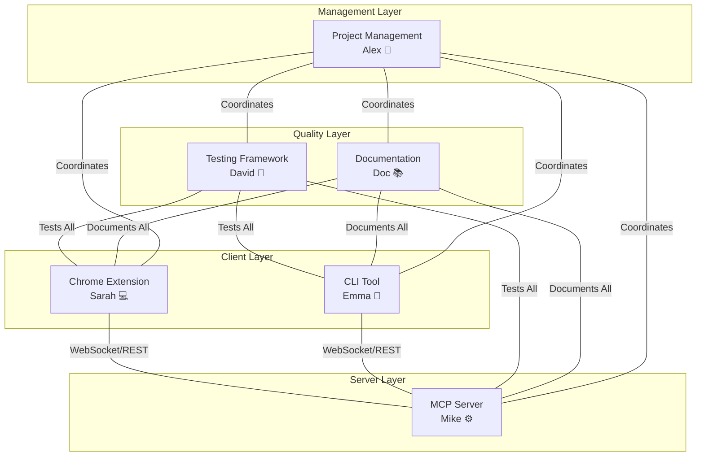
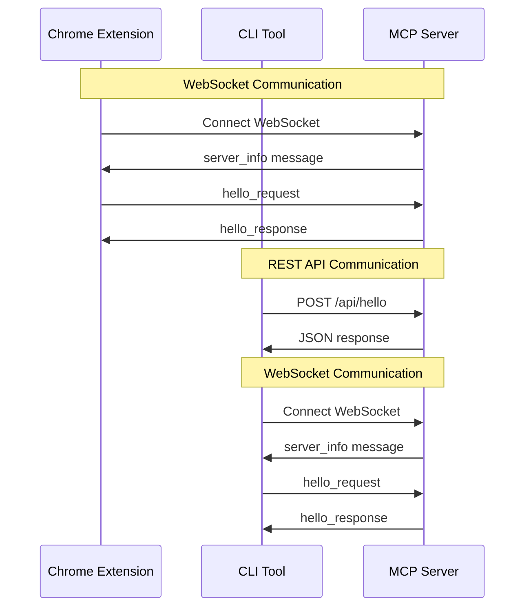

# System Architecture

Detailed architecture documentation for the Hello World Multi-Agent Demo system.

## 🏗️ High-Level Architecture

The system demonstrates a multi-agent development approach với three main components working together:



## 🎯 Agent Responsibilities

### Alex - Project Manager (🎯)
- **Role**: Overall project coordination và sprint management
- **Responsibilities**: 
  - Task assignment và priority management
  - Inter-agent communication coordination
  - Risk management và blocker resolution
  - Stakeholder communication
- **Outputs**: Project plans, sprint schedules, coordination protocols

### Sarah - Frontend Agent (💻)
- **Role**: Chrome Extension development
- **Technology Stack**: HTML5, CSS3, JavaScript ES6+, Chrome Extension APIs
- **Responsibilities**:
  - User interface design và implementation
  - WebSocket client implementation
  - Browser API integration
  - User experience optimization
- **Outputs**: Chrome Extension components, UI/UX elements

### Mike - Backend Agent (⚙️)
- **Role**: MCP Server development
- **Technology Stack**: Node.js, Express, WebSocket (ws), Winston logging
- **Responsibilities**:
  - Server architecture design
  - API endpoint implementation
  - WebSocket server management
  - Database và persistence layer
- **Outputs**: MCP Server, API endpoints, server infrastructure

### Emma - Fullstack Integration Agent (🔧)
- **Role**: CLI tool development và system integration
- **Technology Stack**: Node.js, Commander.js, WebSocket client
- **Responsibilities**:
  - CLI tool development
  - Component integration coordination
  - Build và deployment processes
  - System-wide configuration management
- **Outputs**: CLI tool, integration scripts, deployment configurations

### David - QA Agent (🧪)
- **Role**: Quality assurance và testing
- **Technology Stack**: Jest, Puppeteer, Supertest, Performance testing tools
- **Responsibilities**:
  - Test strategy development
  - Automated test implementation
  - Quality gate enforcement
  - Performance benchmarking
- **Outputs**: Test suites, quality reports, performance metrics

### Doc - Documentation Agent (📚)
- **Role**: Technical documentation và knowledge management
- **Technology Stack**: Markdown, Mermaid diagrams, API documentation tools
- **Responsibilities**:
  - Technical documentation creation
  - API documentation maintenance
  - User guide development
  - Architecture documentation
- **Outputs**: Documentation, API specs, user guides

## 💻 Component Architecture

### Chrome Extension (Sarah)

```
Extension Architecture:
├── manifest.json          # Extension configuration (Manifest V3)
├── popup.html             # Main UI interface
├── popup.css              # Styling và responsive design
├── popup.js               # Main application logic
├── background.js          # Service worker (lifecycle management)
└── content.js             # Content script (page interaction)

Communication Flow:
popup.js ──► WebSocket ──► MCP Server
    ▲              ▲
    │              │
background.js  content.js
```

**Key Features**:
- Manifest V3 compliance
- WebSocket real-time communication
- Local storage for user preferences
- Error handling và retry logic
- Responsive design với accessibility

### MCP Server (Mike)

```
Server Architecture:
├── server.js              # Main server application
├── package.json           # Dependencies và scripts
└── logs/                  # Winston logging output
    ├── error.log          # Error logs
    └── combined.log       # All logs

Server Components:
┌──────────────────┐
│   HTTP Server    │ ──► Express.js middleware
│   (Port 3000)    │ ──► CORS, Helmet security
└──────────────────┘ ──► JSON body parsing
         │
         ▼
┌──────────────────┐
│  WebSocket       │ ──► ws library
│  Server          │ ──► Connection management
└──────────────────┘ ──► Message routing
         │
         ▼
┌──────────────────┐
│  Business Logic  │ ──► Greeting generation
│                  │ ──► Client management
└──────────────────┘ ──► Statistics tracking
```

**Key Features**:
- RESTful API endpoints
- WebSocket real-time messaging
- Client connection management
- Comprehensive logging
- Health monitoring
- Input validation và security

### CLI Tool (Emma)

```
CLI Architecture:
├── bin/hello-cli.js       # Executable entry point
├── index.js               # Main CLI application
├── package.json           # Dependencies và commands
└── node_modules/          # Dependencies

Command Structure:
hello-cli
├── greet [name]           # Send greeting
├── status                 # Server status
├── interactive            # Interactive mode
├── config                 # Configuration management
└── test                   # Connectivity tests

Communication Modes:
CLI ──► REST API ──► MCP Server
CLI ──► WebSocket ──► MCP Server
```

**Key Features**:
- Commander.js command framework
- Dual communication (REST + WebSocket)
- Interactive mode support
- Configuration management
- Colorized output với Chalk
- Progress indicators với Ora

## 🔄 Communication Protocols

### WebSocket Protocol

```javascript
// Message Format
{
  "type": "message_type",
  "data": {
    // Type-specific payload
  }
}

// Message Types
- server_info      # Server welcome message
- hello_request    # Client greeting request
- hello_response   # Server greeting response
- ping/pong        # Keep-alive messages
- get_stats        # Statistics request
- stats_response   # Statistics data
- error            # Error messages
```

### REST API Protocol

```
HTTP Methods:
GET  /health              # Server health check
POST /api/hello           # Send greeting
GET  /api/stats           # Server statistics
GET  /api/clients         # Connected clients
GET  /api/test            # Connectivity test

Response Format:
{
  "data": "response_data",
  "timestamp": "ISO_string",
  "agent": "agent_name"
}
```

## 🧪 Testing Architecture

### Test Strategy Pyramid

```
                    ▲
                   /|\
                  / | \
                 /  |  \
            E2E /   |   \ Browser Testing
               /    |    \ (Puppeteer)
              /     |     \
         Integration|      \
            /       |       \
           /        |        \
          /   Unit Tests      \
         /    (All Agents)     \
        /_____________________\
             Performance
```

### Test Categories

**Unit Tests**:
- Individual component testing
- Function-level validation
- Mock dependencies
- Fast execution (< 1s per test)

**Integration Tests**:
- API endpoint testing
- WebSocket communication
- Database operations
- Component interaction validation

**E2E Tests**:
- Full user workflow testing
- Chrome Extension automation
- Cross-browser compatibility
- User experience validation

**Performance Tests**:
- Load testing
- Stress testing
- Response time measurement
- Throughput benchmarking

## 🔒 Security Architecture

### Security Layers

```
┌─────────────────────────────────┐
│         Client Security         │
│  • Input validation             │
│  • XSS prevention               │
│  • CSP headers                  │
└─────────────────────────────────┘
                 │
                 ▼
┌─────────────────────────────────┐
│      Transport Security         │
│  • WebSocket over WSS (prod)    │
│  • HTTPS endpoints (prod)       │
│  • CORS configuration           │
└─────────────────────────────────┘
                 │
                 ▼
┌─────────────────────────────────┐
│        Server Security          │
│  • Helmet.js middleware         │
│  • Input sanitization           │
│  • Rate limiting                │
│  • Error handling               │
└─────────────────────────────────┘
```

### Security Measures

**Chrome Extension**:
- Manifest V3 security model
- Content Security Policy (CSP)
- Limited permissions scope
- Secure WebSocket connections

**MCP Server**:
- Helmet.js security headers
- CORS policy enforcement
- Input validation với Joi
- Winston security logging
- Graceful error handling

**CLI Tool**:
- Secure credential storage
- Input sanitization
- Connection validation
- Error message filtering

## 📊 Data Flow Architecture

### Request/Response Flow



### State Management

**Client State** (Extension/CLI):
- Connection status
- User preferences
- Message history
- Performance metrics

**Server State**:
- Active connections map
- Client session data
- Message history (last 100)
- Server statistics
- Health metrics

## 🚀 Deployment Architecture

### Development Environment

```
Developer Machine:
├── Chrome Browser          # Extension testing
├── Node.js Runtime         # Server execution
├── Terminal/CLI            # CLI tool testing
└── IDE/Editor              # Code development

Port Allocation:
- 3000: MCP Server (HTTP + WebSocket)
- 3001: Integration test server
- Extensions: chrome-extension:// protocol
```

### Production Considerations

**Scalability**:
- Horizontal server scaling
- Load balancer for WebSocket connections
- Database persistence layer
- Redis for session management

**Security**:
- HTTPS/WSS encryption
- API rate limiting
- Authentication layer
- Security headers

**Monitoring**:
- Health check endpoints
- Metrics collection
- Error tracking
- Performance monitoring

## 🔧 Configuration Management

### Environment Configuration

**Development**:
```javascript
{
  "serverUrl": "ws://localhost:3000",
  "apiUrl": "http://localhost:3000",
  "logLevel": "debug",
  "timeout": 5000
}
```

**Production**:
```javascript
{
  "serverUrl": "wss://api.example.com",
  "apiUrl": "https://api.example.com", 
  "logLevel": "info",
  "timeout": 10000
}
```

### Agent Configuration

Each agent maintains its own configuration:

- **Sarah**: Extension manifest, UI settings
- **Mike**: Server ports, database config, logging
- **Emma**: CLI defaults, connection settings
- **David**: Test thresholds, coverage targets
- **Doc**: Documentation templates, output formats

## 📈 Performance Architecture

### Performance Targets

| Component | Metric | Target |
|-----------|---------|---------|
| REST API | Response Time | < 100ms |
| WebSocket | Message Latency | < 50ms |
| Extension | Load Time | < 2s |
| CLI | Command Response | < 1s |
| Tests | Suite Execution | < 60s |

### Optimization Strategies

**Frontend** (Sarah):
- Efficient DOM manipulation
- WebSocket connection pooling
- Lazy loading of resources
- Caching strategies

**Backend** (Mike):
- Asynchronous request handling
- Connection pooling
- Memory-efficient data structures
- Optimized logging

**Integration** (Emma):
- Command optimization
- Parallel execution
- Resource cleanup
- Configuration caching

---

*This architecture documentation is maintained by Doc 📚 và reviewed by all agents to ensure accuracy và completeness.*